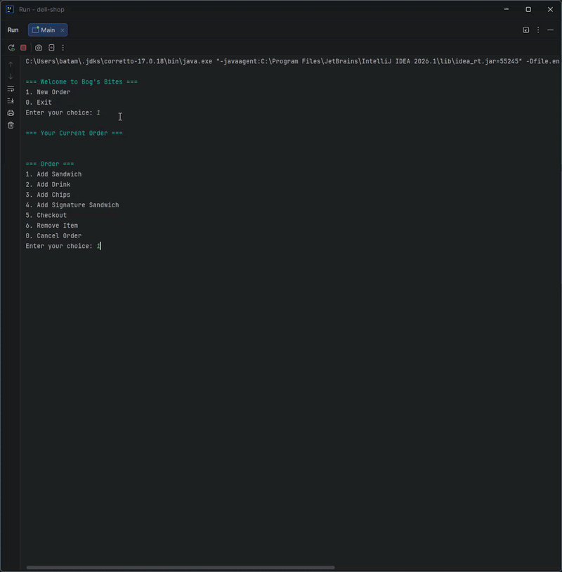

# Project Title

## UML Diagram

## Description of the Project

This application is a point of sale system for a sandwich shop. It is intended for customers who want to order from the store. It allows them
to customize their meal by selecting bread type, bread size, and different toppings for their sandwich. They can also select what drinks and
chips they want. This application aims to solve the stores problem of managing all their orders manually on paper by automating the whole 
process. The application walks the customer through customizing their order and saves the receipt to a file so the store can keep a record.

## User Stories

- As a customer, I want to be able to make an order, so that I can add all the food I want.
- As a customer, I want to be able to add a sandwich to my order and customize it, so I can purchase the sandwich I want.
- As a customer, I want to be able to add extra toppings to my sandwich, so I can get exactly what I like.
- As a customer, I want to be able to add a drink to my order, so I can have a drink with my meal.
- As a customer, I want to be able to add chips to my order, so I can have a light snack if I wanted to.
- As a customer, I want to be able to view my whole order before I checkout, so I can confirm I ordered everything I want.
- As a customer, I want to be able to cancel my order, so that I could cancel if I changed my mind.
- Task: If order has no sandwich, customer must buy a drink or chips.
- As a customer, I want to be able to easily navigate through menus, so that I can make selections and build my order.
- As a customer, I want to receive a receipt when I purchase the order, so that I have a record of my purchase.

## Setup

Instructions on how to set up and run the project using IntelliJ IDEA.

### Prerequisites

- IntelliJ IDEA: Ensure you have IntelliJ IDEA installed, which you can download from [here](https://www.jetbrains.com/idea/download/).
- Java SDK: Make sure Java SDK is installed and configured in IntelliJ.

### Running the Application in IntelliJ

Follow these steps to get your application running within IntelliJ IDEA:

1. Open IntelliJ IDEA.
2. Select "Open" and navigate to the directory where you cloned or downloaded the project.
3. After the project opens, wait for IntelliJ to index the files and set up the project.
4. Find the main class with the `public static void main(String[] args)` method.
5. Right-click on the file and select 'Run 'YourMainClassName.main()'' to start the application.

## Technologies Used

- Java: JDK 17

## Demo

## Future Work

Outline potential future enhancements or functionalities you might consider adding:

- Give users an option to remove toppings
- Create a nicer looking menu
- Give users and option to get a combo meal

## Resources

- [Java Visual Learning Hub](https://raymaroun.github.io/yearup-java-visuals/index.html)
- [RayMaroun solution Repos](https://github.com/RayMaroun/yearup-spring-section-8-2026)
- [w3schools](https://www.w3schools.com/java/)
- [geekforgeeks](https://www.geeksforgeeks.org/java/stream-in-java/)

## Team Members

- **Bogdan Atamyeyev** - Lead Developer

## Thanks

- Thank you to [Raymond Maroun] for continuous support and guidance.
- A special thanks to all my colleagues for all their help.
 